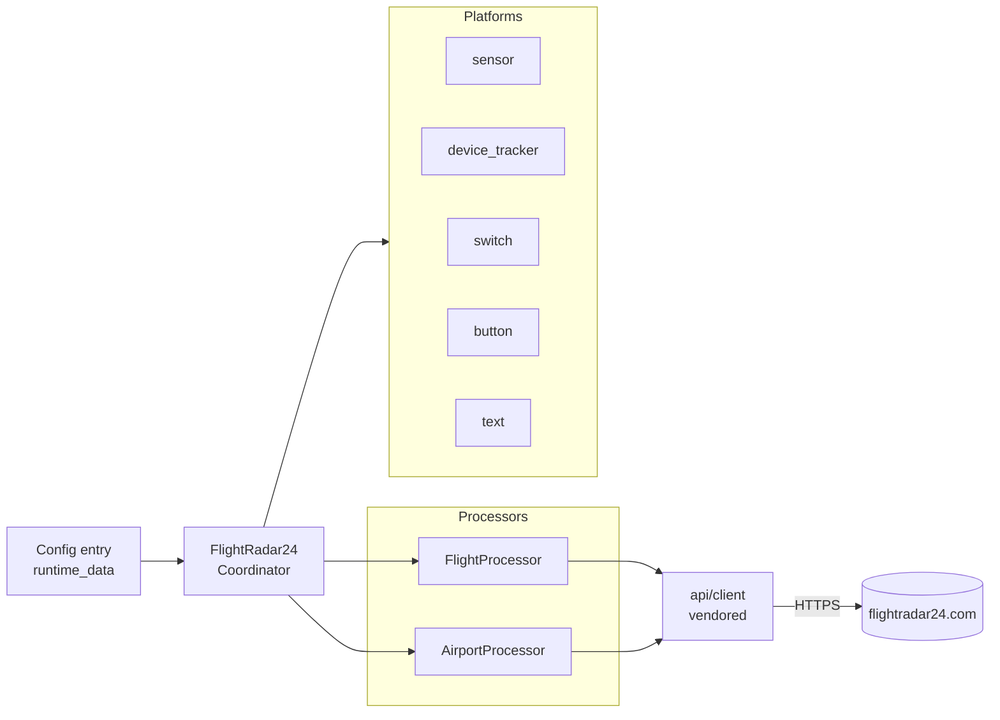

# Flightradar24 integration for Home Assistant

[](https://www.home-assistant.io/)
[](https://hacs.xyz/)
[](LICENSE)
[](https://github.com/AlexandrErohin/home-assistant-flightradar24)

> [!NOTE]
> This repository is a fork of
> [AlexandrErohin/home-assistant-flightradar24](https://github.com/AlexandrErohin/home-assistant-flightradar24).
> All credit for the original integration design, upstream maintenance, and
> documentation goes to Alexandr Erohin. This fork modernises the integration
> against current Home Assistant conventions and vendors the Flightradar24
> client locally so the integration no longer depends on the third‑party
> `FlightRadarAPI` PyPI package.

Flightradar24 integration tracks flights overhead a given region, follows
specific planes, and surfaces departures / arrivals / delay statistics for
an airport — all as Home Assistant entities and events. No FR24
subscription is required; authenticating with an FR24 account unlocks
extra premium fields (see [Premium login](#premium-login)).

## Table of contents

- [What this fork changes](#what-this-fork-changes)
- [Requirements](#requirements)
- [Installation](#installation)
- [Configuration](#configuration)
- [Tracking a specific flight](#tracking-a-specific-flight)
- [Architecture](#architecture)
- [Entities](#entities)
- [Premium login](#premium-login)
- [Development](#development)
- [License](#license)

## What this fork changes

- **Vendored API client.** The `FlightRadarAPI` PyPI dependency has been
  stripped to the ~7 endpoints this integration actually uses and copied
  locally into `custom_components/flightradar24/api/client/` (MIT, original
  copyright preserved). ~1700 lines of upstream code → ~360 lines, no
  `BeautifulSoup` or `brotli` dependencies.
- **Modern Home Assistant conventions**: migrated to `entry.runtime_data`,
  `ConfigEntry[T]`, plain `OptionsFlow`, `_attr_has_entity_name = True`
  everywhere, translation keys for all entity names, typed data update
  coordinator, `asyncio.gather` for parallel upstream calls.
- **Services** — `flightradar24.track_flight`, `untrack_flight`,
  `clear_tracked`, and `search_flight` (with service response) let users
  track flights from Developer Tools, automations, or Lovelace buttons
  instead of pasting into a text entity.
- **Reauth flow** — bad credentials now raise `ConfigEntryAuthFailed`
  and surface a HA "Reconfigure" prompt instead of a silent retry loop.
- **Diagnostics platform** — click *Download diagnostics* on the integration
  card for a redacted dump of config + coordinator state.
- **Config flow uses selectors** — `NumberSelector` with unit hints,
  `BooleanSelector`, `TextSelector(type=PASSWORD)`.
- **New authenticated data**: airport weather (METAR-style temperature,
  wind, pressure, humidity, visibility, sky condition), aircraft count on
  ground, yesterday / recent delay stats, ground schedule, and
  EMS / Mode‑S fields on tracked flights.
- **Correctness fixes**: coordinator now raises `UpdateFailed` on upstream
  errors, config entries get a stable `unique_id`, unload cleans up
  properly, `get_airport_details` default `flight_limit` dropped from 100
  to 50 (matches the internal limit).

## Requirements

> [!IMPORTANT]
> Home Assistant **2026.4.0** or newer. Lower versions are missing
> `entry.runtime_data`, typed `ConfigEntry[T]`, and the auto-wired
> `OptionsFlow.config_entry` property this fork relies on.

- HACS (recommended) for easy install and updates.
- Optional: a Flightradar24 account to unlock richer data on
  `get_flights` and `get_airport_details` (see [Premium login](#premium-login)).

## Installation

### HACS

1. In HACS, add this repository as a custom integration.
2. Install **Flightradar24** and restart Home Assistant.

### Manual

1. Copy `custom_components/flightradar24/` into your HA `custom_components/`
   directory.
2. Restart Home Assistant.

## Configuration

1. **Settings → Devices & services → + ADD INTEGRATION → Flightradar24**.
2. Fill in radius (m), latitude, longitude, and scan interval (s).
3. Submit.

After adding the entry you can edit altitude bounds, toggle most-tracked
and per-flight device_tracker, and enter a Flightradar24 username/password
under the entry's **Configure** button.

## Tracking a specific flight

Three equivalent ways, pick whichever fits the context:

1. **Developer Tools → Services** — the fastest interactive path. Type
   `flightradar24` into the service picker and you'll find:

   | Service | Purpose |
   |---|---|
   | `flightradar24.track_flight` | Add a flight by number / callsign / registration |
   | `flightradar24.untrack_flight` | Remove a flight from the tracked list |
   | `flightradar24.clear_tracked` | Remove every flight from the tracked list |
   | `flightradar24.search_flight` | Search FR24 — returns matches as service response |

2. **Automations / scripts** — call the same services from YAML:

   ```yaml
   # Track BA117 when I say "Hey Google, track the flight"
   action:
     - service: flightradar24.track_flight
       data:
         number: "BA117"
   ```

3. **Dashboard entities** — the `text.*_add_to_track` and
   `text.*_remove_from_track` inputs still work for copy‑paste UX.

When a flight can't be resolved, the integration surfaces it two ways:

- Service calls (`flightradar24.track_flight`) raise `ServiceValidationError`
  with a translated message — HA shows a red toast in the UI.
- Both service calls and `text.*_add_to_track` fire
  `flightradar24_flight_not_found` on the event bus, so you can route the
  failure to any notification channel:

  ```yaml
  # Example: persistent notification when a flight isn't found
  trigger:
    - platform: event
      event_type: flightradar24_flight_not_found
  action:
    - service: persistent_notification.create
      data:
        title: Flightradar24 — flight not found
        message: "Could not track '{{ trigger.event.data.number }}'."
  ```

> [!TIP]
> `search_flight` returns results as a **service response**, so you can
> inspect matches interactively in Developer Tools before calling
> `track_flight`:
>
> ```yaml
> action:
>   - service: flightradar24.search_flight
>     data:
>       query: "BA117"
>     response_variable: match
>   - service: flightradar24.track_flight
>     data:
>       number: "{{ match.results.live[0].detail.flight }}"
> ```

## Architecture



The coordinator polls on the user-configured `scan_interval` and fans out
four executor jobs in parallel (`asyncio.gather`): flights in area,
tracked flights, most-tracked, and airport details. Entities inherit a
shared `FlightRadar24Entity(CoordinatorEntity)` base so device grouping,
`has_entity_name`, and `unique_id` formatting stay consistent across
platforms.

## Entities

### Events

| Event | Fires when |
|---|---|
| `flightradar24_entry` | A flight enters the configured area |
| `flightradar24_exit` | A flight leaves the configured area |
| `flightradar24_area_landed` | A flight lands inside the area |
| `flightradar24_area_took_off` | A flight takes off inside the area |
| `flightradar24_tracked_landed` | A tracked flight lands |
| `flightradar24_tracked_took_off` | A tracked flight takes off |
| `flightradar24_most_tracked_new` | A new entry appears in FR24's top‑10 most tracked |
| `flightradar24_flight_not_found` | A `track_flight` call (service or text entity) couldn't resolve the number / callsign / registration. Event data: `{number, reason}` |

### Sensors

<details><summary><b>Area &mdash; 5 sensors</b></summary>

| Key | What it reports |
|---|---|
| `current_in_area` | Flights currently in the configured area |
| `entered` | Flights that just entered the area |
| `exited` | Flights that just left the area |
| `most_tracked` | FR24's top‑10 most-tracked flights |
| `tracked` | Additional tracked list (restored across restarts) |

Each sensor exposes the full flight list as a `flights` attribute.
</details>

<details><summary><b>Airport &mdash; today (10 sensors)</b></summary>

| Direction | Keys |
|---|---|
| Arrivals | `arrivals`, `arrivals_on_time`, `arrivals_delayed`, `arrivals_delay_average`, `arrivals_delay_index`, `arrivals_canceled` |
| Departures | `departures`, `departures_on_time`, `departures_delayed`, `departures_delay_average`, `departures_delay_index`, `departures_canceled` |

`arrivals` / `departures` carry the next 50 flights as a `flights` attribute.
</details>

<details><summary><b>Airport &mdash; yesterday (6 sensors)</b></summary>

`{arrivals,departures}_{on_time,delayed,canceled}_yesterday` — the
previous-day breakdown from FR24's `stats.yesterday.quantity.*`.
</details>

<details><summary><b>Airport &mdash; recent (6 sensors)</b></summary>

`{arrivals,departures}_{on_time,delayed,canceled}_recent` — the "recent"
aggregated window from FR24's `stats.recent.quantity.*`.
</details>

<details><summary><b>Airport &mdash; weather (10 sensors)</b></summary>

| Key | Unit | Device class |
|---|---|---|
| `weather_temperature` | °C | `TEMPERATURE` |
| `weather_dewpoint` | °C | `TEMPERATURE` |
| `weather_wind_speed` | kn | `WIND_SPEED` |
| `weather_wind_direction` | ° | — |
| `weather_pressure` | hPa | `ATMOSPHERIC_PRESSURE` |
| `weather_humidity` | % | `HUMIDITY` |
| `weather_visibility` | km | `DISTANCE` |
| `weather_condition` | text | — |
| `weather_flight_category` | text (VFR/IFR) | — |
| `weather_metar` | raw METAR | — |

Populated when FR24 returns the `weather` block (usually yes once
logged in).
</details>

<details><summary><b>Airport &mdash; aircraft count (3 sensors)</b></summary>

| Key | What it reports |
|---|---|
| `aircraft_ground` | Total ground count at the airport |
| `aircraft_on_ground_visible` | Visible aircraft on ground |
| `aircraft_on_ground_total` | Total aircraft on ground |

</details>

<details><summary><b>Airport &mdash; ground schedule (1 sensor)</b></summary>

`airport_ground` — count of aircraft currently parked at the airport.
The `flights` attribute lists up to 50 aircraft with registration,
model, airline, and time-on-ground fields (`on_ground_since`,
`on_ground_hours`, `on_ground_seconds`).
</details>

### Configuration entities

| Entity | Purpose |
|---|---|
| `switch.*_api_data_fetching` | Pause all upstream calls |
| `text.*_add_to_track` | Start tracking a flight by number / callsign / registration |
| `text.*_remove_from_track` | Stop tracking a flight |
| `text.*_airport_track` | Start tracking an airport (IATA/ICAO); empty clears |
| `button.*_clear_additional_tracked` | Clear the additional-tracked list |
| `device_tracker.flightradar24` | Optional tracker entity for one tracked flight |

## Premium login

> [!TIP]
> Username and password are **optional**. The integration works without
> them — these only unlock extra fields on two upstream endpoints.

When logged in:

- `get_flights` returns EMS / Mode‑S data (mach, indicated/true airspeed,
  outside air temperature, wind aloft, selected altitude) on aircraft
  that broadcast it.
- `get_airport_details` returns the full `weather` block, the ground
  schedule, aircraft-count tiles, and the extended stats periods
  (yesterday / recent).

> [!WARNING]
> If FR24 invalidates your session (for example, after a password reset),
> the integration raises `ConfigEntryAuthFailed` and HA surfaces a
> "Reconfigure" prompt on the integration card. Enter new credentials
> there — the entry reloads automatically on success.

## Development

A Python 3.12+ venv with `flake8` is used for local checks. The repo
ships two helper scripts:

| Script | Purpose |
|---|---|
| `scripts/verify_client.py` | End-to-end smoke test against the live FR24 service. No-auth paths always run; auth paths run when `FR24_USER` / `FR24_PASSWORD` are set. |
| `scripts/peek_shape.py` | Dump the *shape* (key paths + value types) of authenticated `get_flight_details` / `get_airport_details` responses. Useful when FR24 changes their payload schema. Never prints values. |

```bash
# Lint + byte-compile
.venv/bin/python -m flake8 custom_components scripts
.venv/bin/python -m compileall -q custom_components/flightradar24 scripts

# Live smoke test (authed checks run only if creds are in env)
.venv/bin/python scripts/verify_client.py

# With credentials
FR24_USER='you@example.com' FR24_PASSWORD='...' \
    .venv/bin/python scripts/verify_client.py
```

> [!CAUTION]
> `scripts/verify_client.py` intentionally attempts a login with bogus
> credentials as part of its checks. That attempt is logged by FR24
> against your outgoing IP. Remove the `login with bad creds` test
> from the script if that's a concern.

## License

MIT — see [LICENSE](LICENSE). The vendored client under
`custom_components/flightradar24/api/client/` is also MIT, originally
Copyright © 2020 Jean Loui Bernard Silva de Jesus
([FlightRadarAPI](https://github.com/JeanExtreme002/FlightRadarAPI)).
The upstream integration is Copyright © 2023 Alexandr Erohin; see the
[original project](https://github.com/AlexandrErohin/home-assistant-flightradar24)
for the canonical documentation, automation examples, and Lovelace
dashboards.
